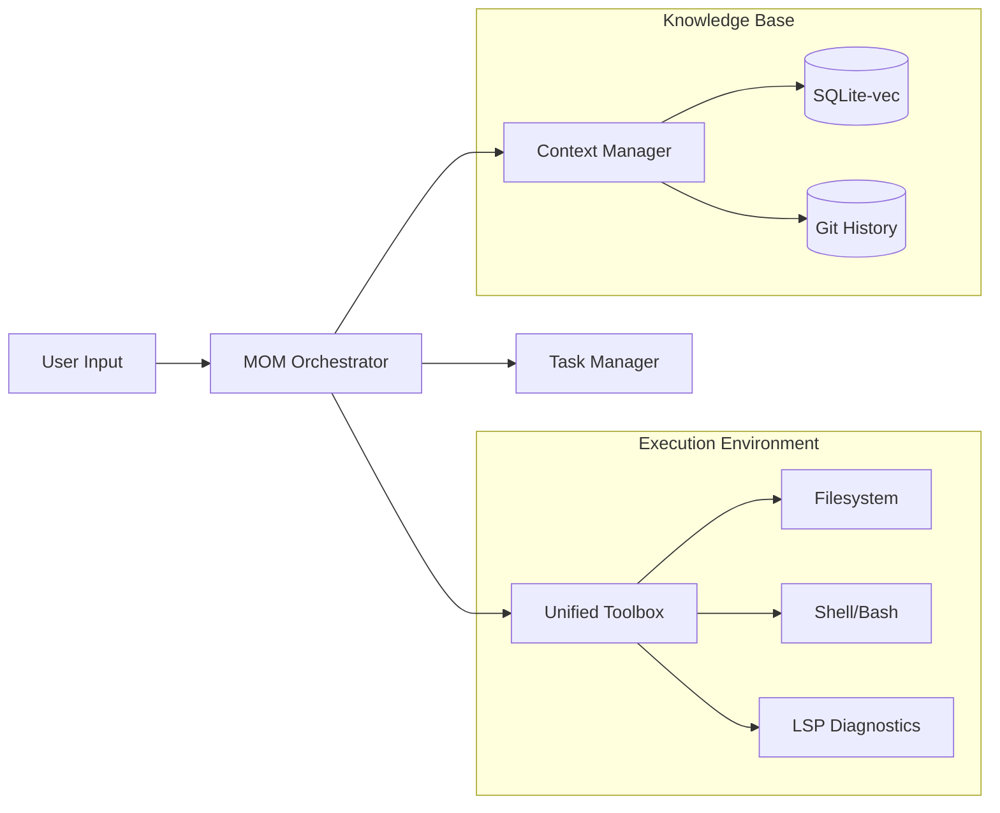

# 🌌 Next ZenCode: The Autonomous Developer's Forge

**Next ZenCode** is a next-generation, self-hosted AI development platform that transforms the way software is built. It is not just a "copilot"; it is a full-fledged **AI Agent Interface** designed to live within your codebase, understand your architectural patterns, and execute complex engineering tasks with precision.

By combining high-performance runtimes, advanced semantic search, and a modular tool-based architecture, Next ZenCode provides a secure, private, and blazingly fast environment for agentic software engineering.

---

## 🚀 1. The Executive Summary

In the modern development landscape, developers are often slowed down by context switching, boilerplate code, and the overhead of managing complex refactors. Next ZenCode solves this by providing an **Agentic Environment** where an AI can:

1.  **Analyze**: Deeply understand your project using semantic embeddings and LSP diagnostics.
2.  **Plan**: Draft comprehensive execution strategies before touching a single line of code.
3.  **Execute**: Modify files, run shell commands, and install dependencies autonomously.
4.  **Verify**: Validate its own changes using real-time type checking and test execution.

---

## 🧠 2. The "Mind of Machine" (MOM) Operating System

At the core of Next ZenCode is the **MOM Architecture**. Think of MOM as an "Operating System for AI Agents." It provides the abstraction layer that allows a Large Language Model (LLM) to interact safely and effectively with your local system.

### The MOM Service Layer
MOM is composed of several specialized services that work in concert:

*   **The Orchestrator**: The central brain that receives user intent, consults the Task Manager, and decides which tools to invoke.
*   **The Task Manager**: A stateful service that tracks long-running goals. It breaks "Implement a new authentication flow" into 15+ atomic steps, ensuring the agent doesn't get lost in the complexity.
*   **The Context Manager**: A "smart cache" for your codebase. It uses **RAG (Retrieval-Augmented Generation)** via a local vector database to provide the agent with the most relevant code snippets for the current task.
*   **The Tool Scheduler**: Manages the execution of filesystem and shell operations, ensuring atomic writes and preventing race conditions during multi-file edits.

---

## 🎯 3. Core Pillars of the Platform

### I. Privacy & Sovereignty
In an era where data is the new gold, Next ZenCode ensures your code remains **your** code.
*   **Self-Hosted Architecture**: The entire stack runs on your local machine or a private server you control.
*   **Local Vector DB**: We use `sqlite-vec` to store embeddings locally. Your project's semantic map never leaves your device.
*   **Provider Flexibility**: Use **Ollama** for 100% offline local inference, or connect to **Groq**, **Anthropic**, or **Google Gemini** via private API keys.

### II. Real-World Agency
Unlike standard chat interfaces, Next ZenCode has "hands."
*   **Bash Integration**: The agent can run `npm install`, `git commit`, `bun test`, or even deploy to Vercel/AWS using your local credentials.
*   **Smart File Patching**: Our `editFile` tool doesn't just overwrite files; it uses a context-aware search-and-replace algorithm that respects your indentation style and code structure.

### III. The LSP Feedback Loop
Next ZenCode is one of the few platforms that gives the AI access to the **Language Server Protocol**.
*   **Instant Verification**: When the agent writes code, it "sees" the same red squiggles that a human developer sees in VS Code.
*   **Auto-Correction**: If the agent introduces a type error or a missing import, it detects the diagnostic immediately and initiates a self-correction sub-task.

---

## 🛠️ 4. Technical Deep Dive

### High-Performance Semantic Search
We utilize **`sqlite-vec`**, a cutting-edge vector search extension for SQLite, to index your codebase. 
- **Scanning**: The system recursively scans your project (respecting `.gitignore`).
- **Embedding**: It generates vector representations of your functions, classes, and components.
- **Retrieval**: When you ask "How does the auth middleware work?", the system performs a cosine similarity search to find the exact code, even if you don't use the specific keywords.

### The Snapshot & Rollback Engine
Before any multi-file "BUILD" operation, MOM can create a **Git Snapshot**.
- **Location**: Snapshots are stored in a dedicated, hidden git ref within your project or in `~/.zencode`.
- **Safety**: If the agent's plan results in a regression, you can revert the entire project state with a single command, ensuring zero-risk experimentation.

### Typesafe Communication with tRPC
The entire bridge between the Next.js frontend and the Bun-based MOM services is powered by **tRPC**.
- **End-to-End Type Safety**: A change in the server-side tool definitions is immediately reflected in the frontend UI.
- **Streaming Tool Calls**: The UI streams tool execution status in real-time, providing high-visibility into what the agent is doing at any micro-second.

---

## 🧩 5. The Skill System: Limitless Extensibility

Next ZenCode features a unique **Skill System** that allows users to package domain-specific knowledge and tools into reusable modules.

| Skill Type | Description | Example Use Case |
| :--- | :--- | :--- |
| **Framework Skills** | Instructions tailored for specific libraries. | "Refactor this page to use Next.js 16 Server Actions." |
| **DevOps Skills** | Tools for infrastructure management. | "Deploy a new staging environment to AWS CDK." |
| **Compliance Skills** | Rules for security and linting. | "Ensure all new components meet WCAG accessibility standards." |
| **Custom Skills** | User-defined scripts and instructions. | "Apply our internal design system patterns to this folder." |

---

## 🔄 6. Workflows & Modes

Next ZenCode adapts to your current mental state through its dual-mode interface:

### 📝 PLAN Mode (Architectural Brainstorming)
In PLAN mode, the agent acts as your **Senior Architect**.
- **ReadOnly**: It can read every file and search the codebase but cannot write.
- **Simulation**: It can "dry run" bash commands to see what *would* happen.
- **Deliverable**: A detailed markdown plan that you can review, edit, or approve.

### 🔨 BUILD Mode (Engineering Execution)
In BUILD mode, the agent becomes your **Staff Engineer**.
- **Read/Write**: Full permission to modify the filesystem.
- **Autonomous Action**: It executes the approved plan, checking off tasks as it goes.
- **Verification**: It runs tests and checks linting after every significant change.

---

## 🛡️ 7. Safety & Security Architecture

We have implemented a multi-layered security model to ensure the agent remains a helpful assistant rather than a destructive force:

1.  **Strict File Scoping**: The agent is restricted to the current working directory unless explicitly granted wider access.
2.  **Sensitive File Masking**: Files like `.env`, `node_modules`, and `.git` are automatically filtered from the agent's view to prevent credential leakage.
3.  **Command Whitelisting**: You can configure which bash commands require manual approval (e.g., `rm -rf`, `npm publish`).
4.  **Human-in-the-Loop**: The agent *always* pauses for confirmation before performing high-impact "BUILD" actions.

---

## 🏗️ 8. The Modern Tech Stack

Next ZenCode is built on a "Best-of-Breed" stack, optimized for the next decade of development:

*   **Runtime**: **Bun** — Why? Blazing fast startup times and native SQLite/Testing/Bundling.
*   **Frontend**: **Next.js 16 + React 19** — Why? For server-side rendering of the agent's complex state and seamless streaming.
*   **Styling**: **Tailwind CSS 4** — Why? Zero-runtime CSS that scales with the project.
*   **State Management**: **Jotai** — Why? For atomic, performant state updates in the chat interface.
*   **Database**: **SQLite** — Why? Zero-config, local-first persistence that is incredibly reliable.

---

## 🚀 9. Getting Started

### Quick Start
1.  **Clone**: `git clone https://github.com/notshekhar/next-zencode.git`
2.  **Install**: `bun install`
3.  **Config**: Add `GOOGLE_GENERATIVE_AI_API_KEY` to your `.env`.
4.  **Run**: `bun dev`

### Community & Contribution
Next ZenCode is an open-source project. We welcome contributions in the form of:
- **New Skills**: Create and share specialized skill modules.
- **Core Enhancements**: Help us improve the MOM orchestrator or the vector search engine.
- **Bug Reports**: Open an issue on GitHub if you find a corner case.

---

*“Code is no longer just written; it is orchestrated. Next ZenCode is the baton.”*
