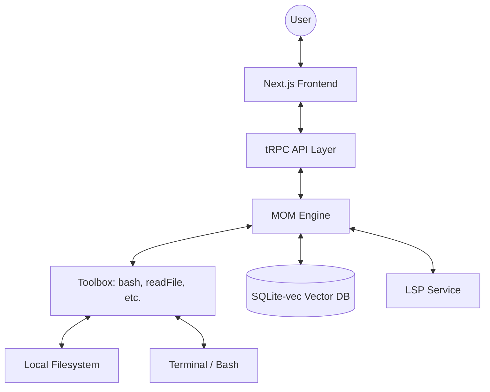

# About Next ZenCode

Next ZenCode is a high-performance, self-hosted AI coding assistant and IDE extension platform built for developers who demand privacy, speed, and deep integration with their local development environment. 

Inspired by modern AI coding agents, Next ZenCode brings a powerful "Agentic" workflow to your codebase, allowing it to not only suggest code but also execute commands, manage files, and understand your entire project structure through semantic search and LSP (Language Server Protocol) integration.

---

## 🚀 Core Philosophy

The project is built on three main pillars:

### 1. **Local First & Privacy Centric**
Your code stays on your machine. Next ZenCode is designed to be self-hosted, giving you full control over which LLM providers you use. Whether you prefer the speed of **Groq**, the power of **Google Gemini**, or the privacy of local models via **Ollama**, your proprietary data never leaves your environment unless you explicitly choose to use a cloud provider.

### 2. **Agentic Execution (MOM)**
At the heart of Next ZenCode is the "Mind of Machine" (MOM) engine. This isn't just a chatbot; it's an agent capable of planning complex tasks, executing them step-by-step, and verifying the results. It moves beyond simple autocomplete to become a true partner in your development process, handling everything from architectural refactors to dependency management.

### 3. **Developer Experience (DX)**
Built with the latest web technologies, it offers a lightning-fast interface with real-time feedback. We believe that an AI tool should be as responsive and reliable as the best IDEs, providing instant diagnostics and a seamless workflow.

---

## 🧠 The "Mind of Machine" (MOM) Architecture

Next ZenCode uses a sophisticated internal architecture called **MOM** to bridge the gap between LLM reasoning and system-level execution. This architecture ensures that the agent can perform its duties reliably while maintaining awareness of the project's state.

### Key MOM Services:



*   **Bash Executor**: Safely runs shell commands in your environment. It includes safety checks to prevent destructive operations and supports a "PLAN mode" where it validates commands without actually running them.
*   **File Tracking & Snapshots**: Automatically tracks changes and can create/restore snapshots using a hidden git repository located in `~/.zencode/snapshots`. This is like having an automatic `undo` for complex, multi-file changes.
*   **Codebase Context**: Efficiently manages the LLM's context window. It uses semantic search to find the most relevant pieces of code, ensuring the AI always has the right information to solve the task at hand.
*   **Task Manager**: Keeps track of complex, multi-step goals. It allows the agent to break down a large request into manageable sub-tasks and report progress accurately to the user.
*   **LSP Integration**: Leverages the `typescript-language-server` to provide real-time type checking. If the agent introduces a type error, it catches it immediately and attempts to fix it.
*   **Tool Execution Scheduler**: Manages concurrent tool calls, ensuring that file reads and writes are performed in a consistent order to prevent race conditions.

---

## 🛠️ Tooling & Capabilities

Next ZenCode comes equipped with a powerful suite of tools that the agent can use to interact with your project:

### 📂 Filesystem Operations
-   `readFile`: Read the content of any file in your project with support for large files via offset/limit.
-   `writeFile`: Create new files with specified content.
-   `editFile`: Perform targeted edits on existing files using a robust search-and-replace mechanism that handles context and indentation.
-   `listFiles`: Explore the directory structure.
-   `searchFiles`: Quickly find files by name or pattern.

### 🔍 Search & Discovery
-   `grepSearch`: Fast text-based searching across the project using optimized patterns.
-   `searchCodebase`: Semantic search using vector embeddings. It indexes your code into a local `sqlite-vec` database, allowing you to find code based on *what it does* rather than just *what it contains*.

### 🐚 System Interaction
-   `bash`: Full terminal access for running tests, installing packages, or managing version control. In BUILD mode, this is a powerful way for the agent to verify its own work.

### 🧩 Skill System
A modular extension system that allows adding specialized capabilities. Skills are defined as sets of instructions and resources that can be "activated" by the agent when needed.
-   **listSkills**: Discover available skills in the project or global store.
-   **activateSkill**: Load a skill's context and instructions into the current session.
-   **Skill Scaffolding**: Automatically generate templates for new skills.

---

## 🔄 Two Modes of Operation

To ensure safety and efficiency, Next ZenCode operates in two primary modes:

### 1. **PLAN Mode**
The agent acts as a consultant. It explores the codebase, analyzes requirements, and drafts a step-by-step execution plan. It cannot modify files or run destructive commands. This is perfect for architectural discussions and brainstorming.

### 2. **BUILD Mode**
The agent is "unlocked." It follows the established plan (or creates a new one) and begins executing changes. It can write code, run terminal commands, and use its full toolset to complete the task.

---

## 🏗️ Technical Stack

Next ZenCode is built with a modern, high-performance stack:

-   **Runtime**: [Bun](https://bun.sh/) — For its blazing speed, built-in SQLite support, and unified tooling.
-   **Framework**: [Next.js 16 (App Router)](https://nextjs.org/) — Utilizing the latest features like Server Components and advanced streaming.
-   **UI Library**: [React 19](https://react.dev/) — Leveraging the latest concurrent features and improved hooks.
-   **AI Integration**: [Vercel AI SDK](https://sdk.vercel.ai/) — Providing a unified interface for multiple LLM providers.
-   **State Management**: [Jotai](https://jotai.org/) (for lightweight client state) and [TanStack Query](https://tanstack.com/query/latest) (for server state synchronization).
-   **Styling**: [Tailwind CSS 4](https://tailwindcss.com/) — Next-generation styling with CSS-first configuration.
-   **Communication**: [tRPC](https://trpc.io/) — End-to-end typesafe API layer between the frontend and the MOM services.
-   **Database**: [SQLite](https://sqlite.org/) with `sqlite-vec` for local vector storage and semantic search.
-   **Visualizations**: [Mermaid.js](https://mermaid.js.org/) for rendering diagrams and [Shiki](https://shiki.style/) for beautiful code syntax highlighting.

---

## 🛡️ Safety & Reliability

Automated code modification can be risky. Next ZenCode implements several safeguards:

-   **LSP Verification**: After every edit, the agent checks for TypeScript errors. If it introduces a bug, it will attempt to fix it immediately.
-   **Git Snapshots**: Before making significant changes, the system can capture a snapshot of the current state, allowing for one-click rollbacks.
-   **Context Awareness**: The agent is aware of `.gitignore` and sensitive files, preventing accidental exposure of credentials.
-   **Permissions System**: You have full control over which commands the agent is allowed to run.

---

## 🚀 Getting Started

1.  **Clone the Repository**:
    ```bash
    git clone https://github.com/notshekhar/next-zencode.git
    cd next-zencode
    ```

2.  **Install Dependencies**:
    ```bash
    bun install
    ```

3.  **Configure Environment**:
    Create a `.env` file and add your preferred LLM provider's API key:
    ```env
    GOOGLE_GENERATIVE_AI_API_KEY=your_key
    # Or other providers like GROQ_API_KEY, ANTHROPIC_API_KEY, etc.
    ```

4.  **Run Development Server**:
    ```bash
    bun dev
    ```

Open [http://localhost:3000](http://localhost:3000) to start your first agentic session.

---

## 🔮 Future Roadmap

We are constantly working to improve Next ZenCode. Some of the features we're excited about include:

-   **Enhanced Skill Ecosystem**: More built-in skills for popular frameworks like Prisma, Tailwind, and AWS.
-   **Collaborative Mode**: Allow multiple developers to interact with the same agent session in real-time.
-   **Custom LLM Fine-Tuning**: Tools to fine-tune local models on your own codebase for even better suggestions.
-   **Improved Multi-Modal Capabilities**: The ability to understand and generate UI mockups and diagrams.
-   **Deep IDE Integration**: Plugins for VS Code and JetBrains IDEs.

---

*Next ZenCode — Code at the speed of thought, with the precision of a machine.*
